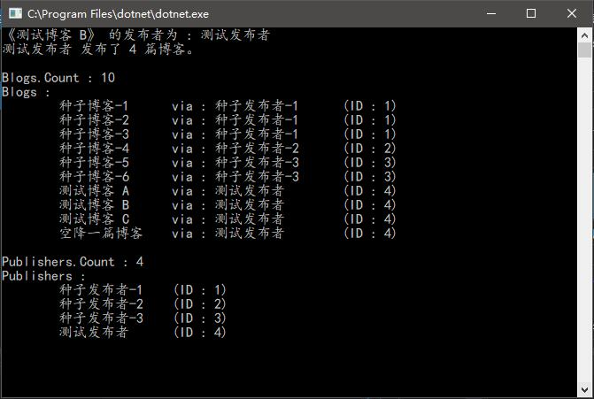
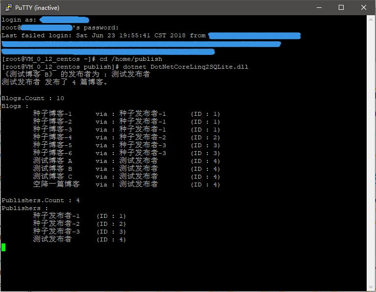

# .Net 平台上 SQLite 数据库基于EntityFramework框架下的CodeFirst模式程序Demo

> ## 解决方案包含两个项目：
> 1>. .Net Framework 4.6 版本；
> 
> 2>. DotNet Core 2.1 版本(跨平台);

程序使用Nuget包提供所需组件，并采用CodeFirst模式。

> ### DotNet Core 2.1 运行截图：

> #### Windows 10：

* DoteNet Core 2.1 program run on Windows 10.

> #### CentOS 7：

* DoteNet Core 2.1 program run on CentOS 7.

